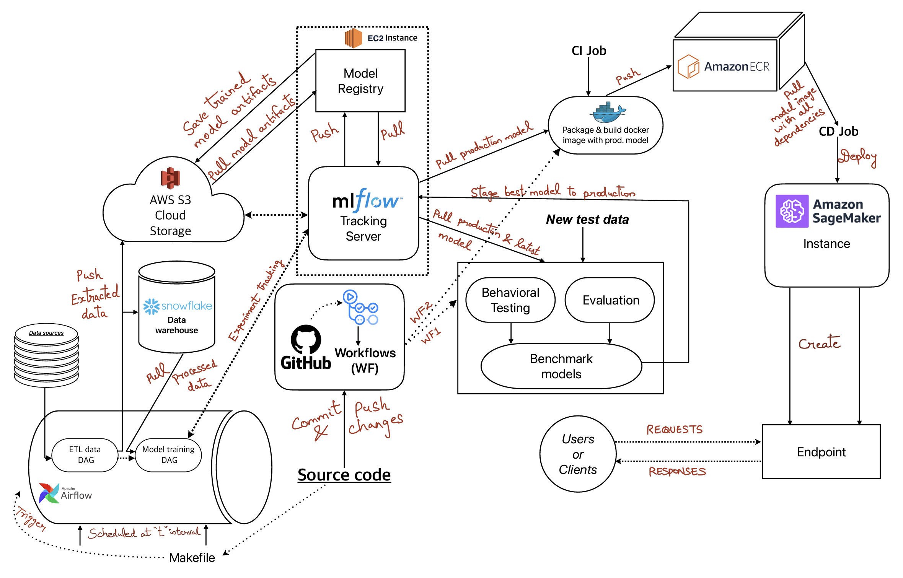
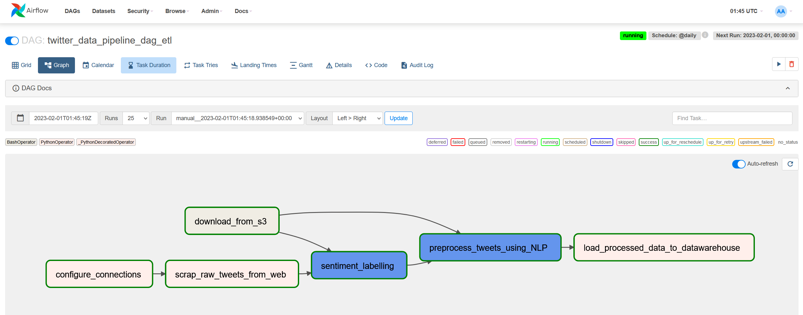
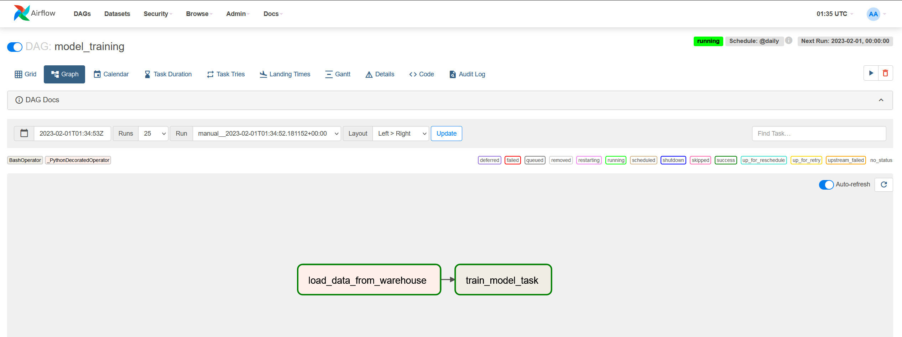
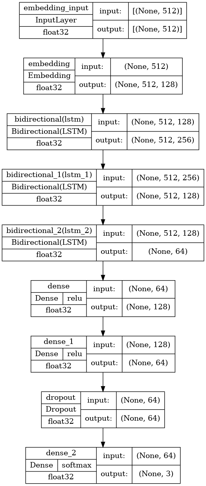
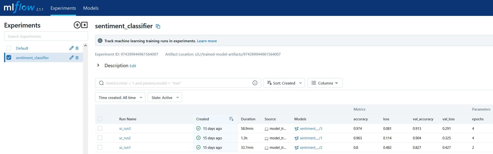
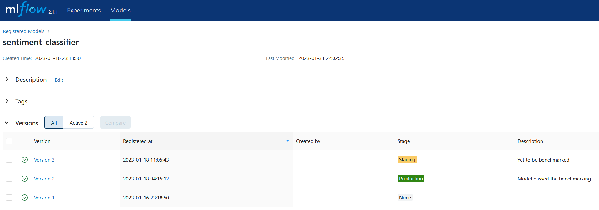
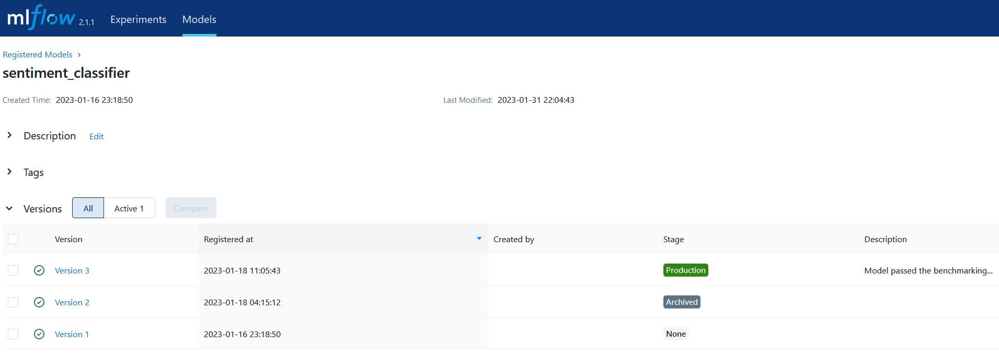
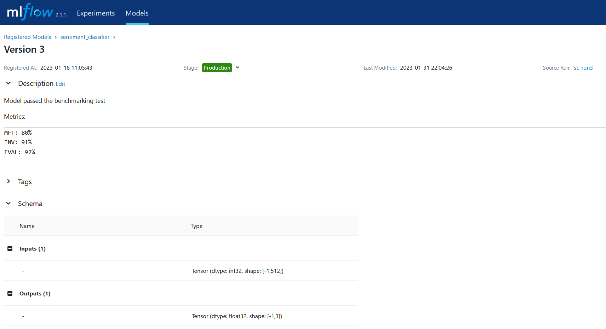
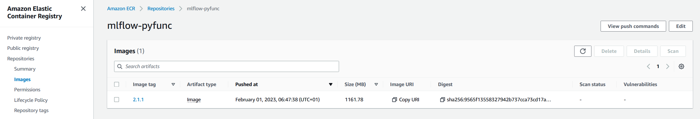
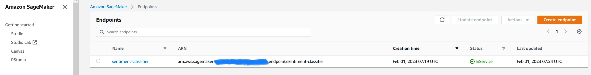

# Sentiment analysis from MLOps paradigm


This project promulgates an **automated end-to-end ML pipeline** that trains a **bi-directional LSTM** network for sentiment analysis task, **tracks** experiments, **pushes** trained models to **model registry**, benchmark them by means of **model testing** and **evaluation**, pushes the best model into production followed by **dockerizing** the production model artifacts into a deployable image and **deploys** the same into cloud instance via **CI/CD**. 

## Author

- [@Jithin Sasikumar](https://www.github.com/Jithsaavvy)

## Languages and Tools

<div align="">
<a href="https://www.python.org" target="_blank" rel="noreferrer"></a>
<a href="https://www.tensorflow.org" target="_blank" rel="noreferrer"></a>
<a href="https://www.docker.com/" target="_blank" rel="noreferrer"></a>
<a href="https://airflow.apache.org/" target="_blank" rel="noreferrer"> </a>
<a href="https://github.com/features/actions" target="_blank" rel="noreferrer"> </a>
<a href="https://www.mlflow.org/docs/latest/python_api/mlflow.html" target="_blank" rel="noreferrer"> </a>
<a href="https://aws.amazon.com/s3/" target="_blank" rel="noreferrer"> </a> 
<a href="https://aws.amazon.com/ec2/" target="_blank" rel="noreferrer"> </a> 
<a href="https://aws.amazon.com/ecr/" target="_blank" rel="noreferrer"> </a>
<a href="https://aws.amazon.com/sagemaker/" target="_blank" rel="noreferrer"> </a> 
<a href="https://aws.amazon.com/sagemaker/" target="_blank" rel="noreferrer"> </a> 
</div>
<br>

## Motivation

In a machine learning (ML) project, it comprises of a chain of tasks like data collection, pre-processing, transforming datasets, feature extraction, model training, model selection, evaluation, deployment. For a small-scale project, these tasks can be managed manually but, as the scalability and scope of the project increases, manual process is really a pain. The actual problem arises when the model has to be productionalized in order to make value out of it. MLOps defines various disciplines to nullify such problems and work efficiently. Thus, pipelines are crucial in an ML project and automating such end-to-end pipelines are also vital.

## Description

The project is a concoction of research (sentiment analysis, NLP, BERT, biLSTM), development (text normalization, ETL, transformation, deep neural network training, evaluation, model testing) and deployment (building and packaging model artifacts, tracking, docker, workflows, pipelines, cloud) by integrating CI/CD pipelines with automated releases.

|  |
|:--:|
| <b>Figure 1: Complete end-to-end project pipeline</b>|

## Technical facets

1. Setting up `Airflow` in docker for `workflow orchestration`.
2. Writing a `Dockerfile` that creates a base docker image with all dependencies installed and secrets containing sensitive credentials and access tokens are mounted.
2. Defining `ETL` and `model training` workflow followed by scheduling them for orchestration.
3. Executing `Airflow DAGs`:
    - **ETL** - Performs Extract, Transform and Load operation on twitter data. As a result, raw tweets scraped from twitter are processed and loaded into `Snowflake data warehouse` as database table.
    - **Model_training** - Deep end-to-end `biLSTM` model is trained using `Tensorflow` by fetching processed data from data warehouse.
4. Tracking the entire model training using `MLflow server` hosted on `AWS EC2 instance` from which trained model artifacts, metrics and parameters are logged.
5. Using `AWS S3 buckets` to store the model artifacts and data.
6. Adding the trained model to `MLflow model registry` on `AWS EC2 instance` that facilitates in managing, maintaining, versioning, staging, testing and productionalizing the model collaboratively.
7. Automating the `pipeline` as follows:
    - Initialize `GitHub Actions` workflows.
    - `benchmark_and_test_model.yml` => In order to productionalize a model, simply evaluating the model is not sufficient. So, it is very important to test them. Thus, the best model is pushed into **production stage** by means of **benchmarking** (`behavioral testing` + evaluation).
    - `deploy.yml` => The production model from model registry in `EC2 instance` is packaged into a docker image with all required dependencies & metadata as a `deployable model artifact` and pushed into `Amazon ECR` **(CI job)**. The deployable image is then deployed into `AWS Sagemaker` instance which creates an **endpoint** that can be used to communicate with the model for inference **(CD job)**.
    - `run_dags.yml` - Triggers Airflow DAG run that performs ETL and model training task based on schedule.
    -  `release.yml` => A new release will be created automatically when tags are pushed to the repository.


## Directory structure

```
├── .github
│    └── workflows
│        ├── benchmark_and_test_model.yaml
|        ├── deploy.yaml
|        ├── release.yaml
|        └── run_dags.yaml
├── config
│   └── config.toml
├── dags                                # Directory where every Airflow DAG is defined
│   ├── etl_twitter_dag.py
│   ├── model_training_dag.py
│   └── task_definitions
│       ├── etl_task_definitions.py
│       └── model_training.py
├── dependencies                       
│   ├── Dockerfile
│   └── requirements.txt
├── docker-compose.yaml                 # Airflow and it's components run as docker containers
├── images
├── Makefile                            # Set of docker commands for Airflow run
├── README.md
├── scripts                             # Contains code for model testing, evaluation and deployment to AWS Sagemaker
│   ├── behavioral_test.py
│   ├── deploy.py
│   ├── stage_model_to_production.py
│   └── test_data
│       ├── sample_test_data_for_mft.parquet
│       └── test_data.parquet
├── test_results
└── utils
    ├── experiment_tracking.py
    ├── helper.py
    ├── model.py
    └── prepare_data.py

```

## Pipeline
### Dependencies & Secrets management

As mentioned above, Airflow is running in a docker container. In order to install dependencies, a docker image is build with all installed dependencies and it will be used as a base image for `docker-compose`. The dependencies are listed in [requirements.txt](./dependencies/requirements.txt). A more better way would be, to use any kind of dependency management tools like **Poetry** for organizational projects but, it is out of scope  for this project.

One important challenge would be, to manage &  handle sensitive information such as **credentials, access tokens** etc needed for Airflow to connect with other services like `AWS S3`, `Snowflake`, `EC2`. It is vulnerable to use any such sensitive info during `docker build` as they will be exposed as a result of layer caching during image build. The secure way is to mount them into the image as **docker secrets** and then export it as environment variables, so that they aren't leaked. It can be done as follows:

-  Create secrets using the command
```
docker secret create
```

- Mount those secrets into `/run/secrets/` of the container
```
RUN --mount=type=secret,id=<YOUR_SECRET> \
    export <YOUR_SECRET_ID>=$(cat /run/secrets/<YOUR_SECRET>)
```

#### ProTip to do the same in production environment

The aforementioned steps are not well suitable for production. To do so, use `docker stack`. For more info, refer [here](https://docs.docker.com/engine/swarm/stack-deploy/)

### Workflow Orchestration - Airflow

[Apache Airflow](https://airflow.apache.org/) is used to orchestrate workflows in this project. The workflows are represented as **Directed Acyclic Graph** `(DAG)`.

### DAGS

### ETL
It is a data workflow that performs Extract Transform Load `(ETL)` task defined in [etl_twitter_dag.py](./dags/etl_twitter_dag.py) on scheduled interval. It performs the following tasks:
- The raw tweets are scraped from twitter using [snscrape](https://pypi.org/project/snscrape/) library and loaded to `AWS S3 bucket`.
- They are cleaned using **regular expressions** and labelled by calculating **polarity** and also loaded to the same `S3 bucket`.
- The labelled data is normalized and preprocessed using NLP techniques and loaded as **database table** to `Snowflake data warehouse` which can be used for analysis and model training.
- The data is stored in the `parquet` format for efficient storage and retrieval.

|  |
|:--:|
| <b>Figure 2: ETL Data pipeline - Airflow</b>|

### Model training
It is a model training workflow that trains deep end-to-end `biLSTM` network with `BERT tokenizer`. Detailed explanation of biLSTM model can be found [here](#bi-directional-lstm-model). The DAG performs the following tasks:

- Preprocessed data loaded as a result of ETL pipeline is fetched from the database
table of **snowflake data warehouse** as a **dataframe**.
- External (user-build) **docker container** with `tensorflow GPU` and other dependencies installed, is used to train the model. It is facilitated in Airflow by `DockerOperator` as:
```
DockerOperator(
                task_id = "train_model_task",
                image = "model_training_tf:latest",
                auto_remove = True,
                docker_url = "unix://var/run/docker.sock",
                api_version = "auto",
                command = "python3 model_training.py"
            )
```
- The **GPU accelerated** training for the above task is defined in [model_training.py](./dags/task_definitions/model_training.py). Additionally, `BERT tokenizer` is used instead of normal tokenizer **(i.e.)** The texts are tokenized and each tokens are encoded into unique IDs referred as `input_ids`. Finally, they are transformed as `tensorflow datasets` for efficient input pipeline and fed into the model. All these are defined in [prepare_data.py](./utils/prepare_data.py).

|  |
|:--:|
| <b>Figure 3: Model training pipeline - Airflow</b>|

**Note:** <br>
*GPU used for training*: NVIDIA GeForce GTX 980M with `8GB GDDR5` memory

### Bi-directional LSTM model
biLSTM network encompassing an
`embedding layer`, stack of `biLSTM layers` followed by `fully connected dense layers`
with `dropout` is used for this project. The **model plot** is depicted in the below image:

<p align="center">
  
</p>

### MLflow Server

All the experiments are tracked and logged by [MLflow](https://mlflow.org/docs/latest/tracking.html). It is not done locally in a **localhost**, instead the `MLflow Server` is installed and hosted in `AWS EC2 instance` as a **remote tracking server** which paves way for centralized access. The **trained model artifacts** are saved in `AWS S3 bucket` which serves as an artifact store and parameters, metrics (per epoch), all other metadata are logged into EC2 instance itself.

|  |
|:--:|
| <b>Figure 4: All experiment runs on MLflow Server - EC2 Instance</b>|

### MLflow Model Registry

The models to be staged and tested are pushed to the model registry which serves as a **centralized model store**. It facilitates to manage, version, stage, test and productionalize the model and provides functionalities to work on the models collaboratively.

|  |
|:--:|
| <b>Figure 5: Model Registry with already existing production model and staged model - EC2 Instance </b>|

### Benchmarking

The model with latest version and model in production stage are benchmarked by means of behavioral testing and evaluation. This is done to find out whether the latest model outperforms the current production model. If yes, it triggers the `CI/CD` workflow job.

Model testing differs from model evaluation. For instance, a model with high evaluation metric doesn't always guarantee to be the best performing model because, it might fail in some specific scenarios. To solve and quantify that, **model testing** is an important aspect in production.

### Behavioral testing

It is based on this [paper](https://homes.cs.washington.edu/~marcotcr/acl20_checklist.pdf) to test the behavior of the model in specific conditions. [Checklist](https://github.com/marcotcr/checklist) library is used for performing both the tests. These testing functions are defined in [behavioral_test.py](./scripts/behavioral_test.py). Three different types of tests are proposed in the paper but only two of them are performed in this project namely:
- Minimum Functionality test (MFT)
- Invariance test (INV)

### MFT:
MFT is inspired from unit test. A specific behavior (or) capability of the model is tested.

| 1. |         **Model**         |                                                 Sentiment Analysis                                                 |
|----|:-------------------------:|:------------------------------------------------------------------------------------------------------------------:|
| 2. |        **Dataset**        | Perturbed dataset created from a small subset of test dataset with labels. Original texts are negated as perturbed |
| 3. | **Minimum functionality** |                             Negations (i.e.) how well the model handles negated inputs                             |
| 4. |        **Example**        |   *Original text*: This product is very good - **Positive** <br> *Negated text*: This product is not very good - **Negative** |
| 5. |   **Expected behavior**   |              Model should be generalized to predict correct labels for both original and negated text              |
 
### INV

Label-preserving perturbations are applied to the test data. Despite perturbing the data, the model is expected to give the same prediction.

|  1. |         **Model**         |                                                       Sentiment Analysis                                                      |
|:---:|:-------------------------:|:-----------------------------------------------------------------------------------------------------------------------------:|
|  2. |        **Dataset**        |                                Larger subset of test dataset is perturbed by adding invariances and their contexts are preserved                               |
| 3.  | **Invariance** |                      Typos and expanding contractions (i.e.) how well the model handle these invariances                      |
|  4. |        **Example**        | *Original text*: I haven't liked this product - **Negative** <br> *Invariance text*: I have not liekd this prodcut - **Negative** |
|  5. |   **Expected behavior**   |  Model should be generalized to handles these invariances and predict same label for both original and invariance texts  |

Benchmarking (defined in [stage_model_to_production.py](./scripts/stage_model_to_production.py)) is done as follows:
- Latest and current production models are pulled from the model registry.
- Test data (fresh data that the model hasn't seen during training) is fetched from S3 bucket.
- **Behavioral testing** (perturbed data) and **evaluation** (original test data) is performed for both the models and metrics are returned.
- If the latest model outperform the current production model, then push latest model into production and archive current production model.

```
productionalize_ = Productionalize(tracking_uri = config["model-tracking"]["mlflow_tracking_uri"],
                                    test_data = config["files"]["test_data"],
                                    model_name = config["model-registry"]["model_name"],
                                    batch_size = config["train-parameters"]["batch_size"],
                                    sequence_length = config["train-parameters"]["sequence_length"]
                                    )

accuracy_latest_model, accuracy_production_model = productionalize_.benchmark_models()

success_ = productionalize_.push_new_model_to_production(accuracy_latest_model, accuracy_production_model)
```

|  |
|:--:|
| <b>Figure 6: Model Registry with latest model pushed to production model and archiving the other one - EC2 Instance </b>|

|  |
|:--:|
| <b>Figure 7: Model Registry with latest production model - EC2 Instance </b>|

### CI/CD

It involves packaging the model artifacts into an image and deploy them to cloud instance. The steps are as follows:
- The model registry in **EC2 instance** holds the **latest production model** that have passed both testing and evaluation.
- The production model from the model registry is packaged and build into a docker image with all required dependencies & metadata as a **deployable model artifact**.
- This artifact is then pushed into **Amazon ECR** that serves as a container registry. 

|  |
|:--:|
| <b>Figure 8: Deployable docker image pushed to AWS ECR </b>|

- Finally, the deployable image from ECR is deployed into `AWS Sagemaker` instance which creates an **endpoint** that can be used to communicate with the model for inferencing.
- The endpoint can be tested using some tools like `Postman`.
- The aforementioned steps are defined in [deploy.py](./scripts/deploy.py). All the necessary secrets are exported as environment variables. Specific IAM role and user have been created for deployment.

```
sagemaker._deploy(
                mode = 'create',
                app_name = app_name,
                model_uri = model_uri,
                image_url = docker_image_url,
                execution_role_arn = role,
                instance_type = 'ml.m5.xlarge',
                instance_count = 1,
                region_name = region
                )
```

|  |
|:--:|
| <b>Figure 9: Production model deployed to AWS Sagemaker </b>|

**Note:** <br>
*Every AWS resources created for this project will be deleted after the pipeline is executed successfully. This is done on purpose, to restrict and limit any incurring additional cost!!*

## Feedback

If you have any feedback, please reach out to me at jithsasikumar@gmail.com

## Bug / Issues

If you come across any bugs (or) issues related to code, model, implementation, results, pipeline etc, please feel free to open a [new issue here](https://github.com/Jithsaavvy/Sentiment-analysis-from-MLOps-paradigm/issues/new) by describing your search query and expected result.

## References

[Paper - Beyond Accuracy: Behavioral Testing of NLP models with CheckList](https://homes.cs.washington.edu/~marcotcr/acl20_checklist.pdf)

[https://github.com/marcotcr/checklist](https://github.com/marcotcr/checklist)

[AWS Documentations](https://docs.aws.amazon.com/)

[Airflow Docs](https://airflow.apache.org/docs/)